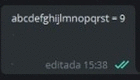
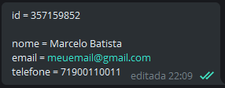

---

[1. O que é](#O-que-é)

[3. Informações](#Informações)

[4. Métodos](#Métodos)

---

### O que é

Telebase é um script feito com a necessidade de resgatar, editar e remover dados, já enviados, em um canal privado do Telegram, fazendo dele uma base de dados externa, através de uma identificação única por mensagem.

### Informações

O Telebase usa Pyrogram, um framework simples e elegante, para se comunicar com o Telegram. 

requirements: 

`` pip3 install -U pyrogram tgcrypto ``

---

Sintaxe da mensagem no Telegram:

`` <nome da chave> = <valor da chave> ``

---

* O aplicativo permite enviar uma mensagem com até 65.536 caracteres. Com essa enorme quantidade, é possível ter diversas chaves, de diferentes tamanhos, contendo valores, de diferentes tamanhos, para cada mensagem. Ou seja, pode ter estes pares de chaves e muito mais:

  

* A mensagem é encontrada a partir de uma informação única qualquer, entre todas as mensagens.

* Para cada chave, uma linha. Não é possível ter duas ou mais, chaves ou igualdades, na mesma linha. Caso o telebase encontre esse erro de sintaxe, será disparado uma exceção, avisando que alguma chave está fora do padrão.  

* Tanto a chave, quanto o valor, são strings. Independente de ser um número ou um caractere especial.

  

* Se a mensagem não for encontrada, é disparado uma exceção informando a mesma.

---

### Métodos

* Todos os métodos retornam um dicionário contendo informações da mensagem com suas respectivas linhas.
---
database = Dados(Client, 'https://')

database.dados()

database.editarValor(chave, novo_valor)

database.adicionarDado(chave, valor)

database.removerDado(chave)

---

No geral, o que a classe faz é, recebe a mensagem, retorna em dicionário; ou, internamente, pega o dicionário e retorna em mensagem pra substituir uma mensagem que será editada.
