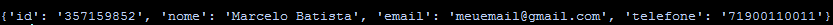
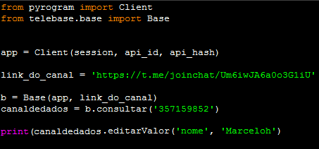
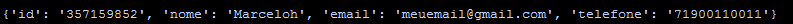
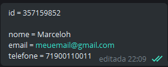
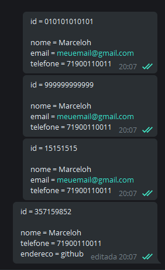

---

[O que é](#O-que-é)

---

### O que é

Telebase é um script feito com a necessidade de resgatar, editar e remover dados, já enviados, em um canal do Telegram, através de uma identificação única por mensagem.

### A ideia

A ideia surgiu quando tive que guardar e modificar alguns dados quando fosse necessário, enquanto meu robô rodava na plataforma em nuvem, Heroku, que suporta várias linguagens de programação. Eu, ainda, não sei banco de dados, então, eu precisava fazer algo em que pudesse manipular esses dados, que o robô recebia. Armazenar num arquivo e fazer uploads no Google Drive ou em outras plataformas de armazenamento em nuvem semelhantes, não era uma alternativa, pois dependendo do tamanho do arquivo, demoraria de mais, subindo e descendo esses arquivos. PasteBin, a API não dar opção de editar arquivos existentes, somente deletar e reenviar um novo arquivo substituto. Não seria uma boa ideia, usar o PasteBin. Pensei, também, no Telegraph, plataforma de publicação de artigos anônimos, que nos dar a possibilidade de publicar esses artigos e editá-los. E pensando bem, não seria uma boa alternativa deixar esses dados exporto numa página de internet, pois não encontrei uma opção de deixá-las privadas. Enfim, pensei no Google Sheets também, mas... no momento, sinto que ainda não estou preparado para usar alguns serviços do Google.

Por enquanto,  a única alternativa, que encontrei, foi usar o Telegram, o mensageiro baseado em nuvem, que permite iniciar uma mensagem com você mesmo no aplicativo, possibilitando salvar textos, mensagens de voz, links, PDF, documentos do Word, músicas, fotos e vídeos. O mais legal disso tudo é que eu tenho mensagens salvas desde 2015 e, realmente, elas nunca foram apagadas.

### Informações importantes

O Telebase usa Pyrogram, um framework simples e elegante, para se comunicar com o Telegram. 

requirements:

`` pip3 install -U pyrogram tgcrypto ``

---

Sintaxe da mensagem no Telegram:

`` <nome da chave> = <valor da chave> ``

---

* O aplicativo permite enviar uma mensagem com até 65.536 caracteres. Com essa enorme quantidade, é possível ter diversas chaves, de diferentes tamanhos, contendo valores, de diferentes tamanhos, para cada mensagem. Ou seja, pode ter estes pares de chaves e muito mais:

* A mensagem é encontrada a partir de uma informação única qualquer, entre todas as mensagens contidas no canal privado. Se existir identificações iguais em mensagens diferentes, será disparado uma exceção avisando que existe duplicidade.

* Não é possível consultar mensagens em canais públicos, grupos públicos/privados ou usuários, exceto você mesmo.

* Para cada chave, uma linha. Não é possível ter duas ou mais, chaves ou igualdades, na mesma linha. Caso o telebase encontre esse erro de sintaxe, será disparado uma exceção, avisando que alguma chave está fora do padrão.  

* Tanto a chave, quanto o valor, são strings. Independente de ser um número ou um caractere especial.

  

* Se a mensagem não for encontrada, é disparado uma exceção informando a mesma.

---

### Métodos

Para ter acessos aos métodos do telebase, é preciso primeiro, ter um objeto instanciado da classe ``Base``. Essa classe recebe dois parâmetros. O primeiro parâmetro, que é obrigatório, recebe uma instância ``Client``, do Pyrogram, para que o script funcione. O segundo parâmetro é opcional, ele recebe o link do canal. O link do canal, pode ser passado como argumento tanto na classe ``Base`` como no método ``consultar`` do objeto da classe ``Dados``, que é retornado quando se cria o objeto da classe ``Base`` ; mas não pode ser passado para os dois ao mesmo tempo, caso aconteça, dispara uma exceção informando que o argumento já foi passado como parâmetro.

Essa flexibilidade foi criada, caso exista a possibilidade de ter que usar mais de um canal para consulta de dados.

---

* Todos os métodos retornam um dicionário contendo informações da mensagem com suas respectivas linhas.

------

#### Os atributos/métodos, considerando somente um canal:

##### dado

###### retorno

##### editarValor(< chave >, <valor que será mudado>)

###### retorno

##### adicionarValor(< chave >, < valor >)

##### removerValor(< chave >)

---

### Resumo

------

